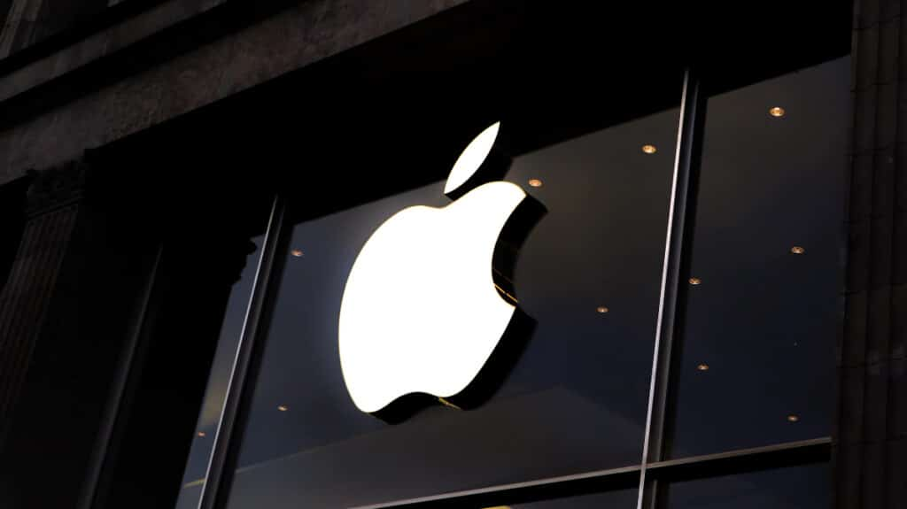
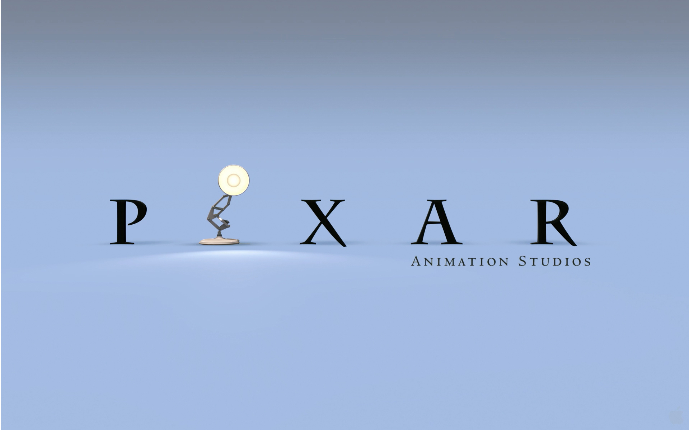
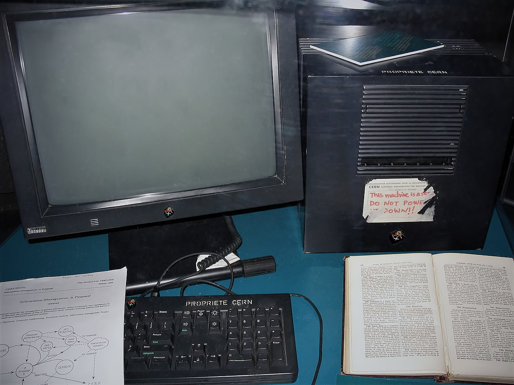

<!DOCTYPE html>
<html lang="ru">
<head>
    <meta charset="UTF-8">
    <meta name="viewport" content="width=device-width, initial-scale=1.0">
    <title>Моё портфолио</title>
    
</head>
<body>

<header>
    <h1>Стив Джобс</h1>
    <nav>
        <a href="#about">О Стив Джобсе</a>
        <a href="#projects">Проекты Стива</a>
        <a href="#contact">Контакты Стива</a>
    </nav>
</header>

    <section id="about">
        <h2>О Стив Джобсе</h2>
        
Стивен Пол Джобс – изобретатель, предприниматель, промышленный дизайнер. Стоял у истоков создания компаний Apple и Pixar.

    </section>

    <section id="projects">
        <h2>Проекты Стива</h2>
        

            

                
                <h3>Проект 1</h3>
                
Apple Inc — американская технологическая корпорация, известная своими инновационными продуктами и высокой рыночной капитализацией.

            

            

                
                <h3>Проект 2</h3>
                
Pixar Animation Studios (наиболее известная как Pixar) — американская студия компьютерной анимации, известная своими рецензентски и коммерчески успешными компьютерными анимационными фильмами. Базируется в Эмеривилле, штат Калифорния. С 2006 года Pixar является дочерней компанией Walt Disney Studios, подразделения Disney Entertainment, которое принадлежит The Walt Disney Company.

            

            

                
                <h3>Проект 3</h3>
                
NeXT Computer (также назывался NeXT Computer System) — персональный компьютер, разработанный компанией NeXT. Выпускался c 1988 по 1990 год с предустановленной UNIX-подобной операционной системой NeXTSTEP. Системная плата была заключена в корпус, представляющий собой идеальный куб со стороной 30,48 см (1 фут)[1]. Изначально продавался напрямую вузам по цене в 6500 долларов США; в 1990 году поступил в розничную продажу по цене 9999 долларов

            

        

    </section>

    <section id="contact">
        <h2>Контакты</h2>
        
Email: <a href="mailto:example@mail.com">example@mail.com</a>

        
Телефон: +7 (777) 123‑45‑67

    </section>

<footer>
    
&copy; 2026 Иван Иванов. Все права защищены.

</footer>

</body>
</html>
